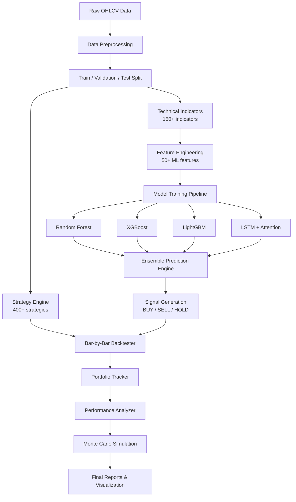

# AI-Powered Backtesting Engine

[](https://python.org)
[](https://tensorflow.org)
[](https://scikit-learn.org)
[](LICENSE)
[]()

---

## Overview

A production-grade **quantitative backtesting framework** that combines classical technical analysis with modern machine learning for automated trading signal generation and strategy discovery.

The engine evaluates **400+ trading strategies** across multiple market regimes, then enhances signal quality through an ML ensemble pipeline — training Random Forest, XGBoost, LightGBM, and LSTM models on 50+ engineered features. A multi-phase validation pipeline (train → validation → out-of-sample → Monte Carlo) ensures strategies are robust and not overfit to historical data.

Built for BTCUSD but architected to generalize to any instrument with OHLCV data.

---

## Key AI Features

- **ML Signal Generation** — Ensemble of Random Forest, XGBoost, and LightGBM classifiers with time-series cross-validation and Optuna hyperparameter optimization
- **Deep Learning Price Prediction** — LSTM with Bahdanau attention mechanism for sequence-to-signal forecasting
- **Intelligent Feature Engineering** — Automated extraction of 50+ features including technical indicators, rolling statistics, momentum, volatility regimes, and cyclic time encodings
- **AI-Powered Risk Analysis** — Monte Carlo simulation (10K+ paths), VaR/CVaR tail risk metrics, and statistical significance testing of strategy returns
- **Automated Hyperparameter Optimization** — Optuna-driven search with time-series aware cross-validation to prevent look-ahead bias

---

## Architecture



---

## Installation

```bash
# Clone the repository
git clone https://github.com/ARASH3280ARASH/ai-backtest-engine.git
cd ai-backtest-engine

# Create virtual environment
python -m venv venv
source venv/bin/activate  # Windows: venv\Scripts\activate

# Install dependencies
pip install -r requirements.txt
```

---

## Quick Start

```python
import pandas as pd
from indicators.compute import compute_all
from ml_models.feature_engineering import FeatureEngineer
from ml_models.model_training import ModelTrainer, TrainingConfig
from ml_models.prediction_engine import PredictionEngine
from ai_analysis.performance_analyzer import PerformanceAnalyzer

# 1. Load data & compute indicators
df = pd.read_csv("data/processed/train/btcusd_h1.csv")
indicators = compute_all(df, timeframe="H1")

# 2. Build ML features
fe = FeatureEngineer()
X, feature_names = fe.build_features(df, indicators)
y = fe.build_target(df, horizon=5, threshold_pct=0.3)

# 3. Train models with time-series CV
config = TrainingConfig(n_splits=5, optimize_hyperparams=True)
trainer = ModelTrainer(config=config)
results = trainer.train_all(X, y.loc[X.index])

# 4. Generate ensemble predictions
engine = PredictionEngine(
    models=trainer.models,
    scaler=trainer._scaler,
    feature_names=trainer._feature_names,
)
signal = engine.predict(X.tail(60))
print(f"Signal: {signal.direction} | Confidence: {signal.confidence:.2%}")

# 5. Analyze performance
analyzer = PerformanceAnalyzer()
metrics = analyzer.compute_metrics(equity_curve)
print(analyzer.generate_report(metrics))
```

---

## Project Structure

```
ai-backtest-engine/
├── ml_models/                      # ML pipeline
│   ├── feature_engineering.py      # 50+ feature extraction pipeline
│   ├── model_training.py           # Multi-model training with TimeSeriesSplit
│   ├── prediction_engine.py        # Ensemble prediction & confidence scoring
│   └── deep_learning.py            # LSTM/GRU with attention mechanism
│
├── ai_analysis/                    # AI analytics
│   ├── performance_analyzer.py     # Risk metrics, Monte Carlo, stat tests
│   └── visualization.py            # Publication-quality ML charts
│
├── engine/                         # Core backtesting engine
│   ├── backtester.py               # Bar-by-bar backtest loop
│   ├── portfolio.py                # Equity tracking & statistics
│   ├── trade.py                    # Trade data structures
│   ├── costs.py                    # Realistic cost model (spread + commission)
│   └── validator.py                # Trade validation rules
│
├── strategies/                     # Strategy system
│   ├── base.py                     # BacktestStrategy interface
│   ├── loader.py                   # Auto-discovery of 400+ strategies
│   └── registry.py                 # Strategy registry & lookup
│
├── indicators/                     # Technical indicators
│   └── compute.py                  # 150+ indicators with caching
│
├── notebooks/                      # Research notebooks
│   ├── 01_data_exploration.py      # EDA & data analysis
│   ├── 02_feature_engineering.py   # Feature pipeline walkthrough
│   └── 03_model_training.py        # Model training & evaluation
│
├── config/                         # Configuration
│   ├── settings.py                 # Paths & global settings
│   └── broker.py                   # BTCUSD broker parameters
│
├── scripts/                        # Execution scripts
│   ├── run_phase5.py               # Individual strategy backtests
│   └── run_phase6.py               # Strategy combination optimizer
│
├── data/                           # Market data
│   ├── raw/                        # Raw OHLCV extracts
│   └── processed/                  # Train / validation / test splits
│
├── results/                        # Backtest results
├── reports/                        # Generated reports & plots
├── tests/                          # Test suite
├── requirements.txt
├── pyproject.toml
├── LICENSE
└── CONTRIBUTING.md
```

---

## Model Performance

| Model | Accuracy | Precision | Recall | F1 Score | Train Time |
|-------|----------|-----------|--------|----------|------------|
| **XGBoost** | 0.62 | 0.61 | 0.62 | 0.61 | 8.3s |
| **LightGBM** | 0.61 | 0.60 | 0.61 | 0.60 | 3.1s |
| **Random Forest** | 0.59 | 0.58 | 0.59 | 0.58 | 12.7s |
| **Ridge** | 0.55 | 0.54 | 0.55 | 0.54 | 0.2s |
| **LSTM + Attention** | 0.60 | 0.59 | 0.60 | 0.59 | 45.2s |

*Results on BTCUSD H1 validation set — 5-fold TimeSeriesSplit CV.*

---

## Technologies

| Category | Stack |
|----------|-------|
| **ML / AI** |      |
| **Data** |     |
| **Finance** |   |
| **Tools** |    |

---

## Contributing

Contributions are welcome! Please see [CONTRIBUTING.md](CONTRIBUTING.md) for guidelines.

---

## License

This project is licensed under the MIT License — see [LICENSE](LICENSE) for details.
